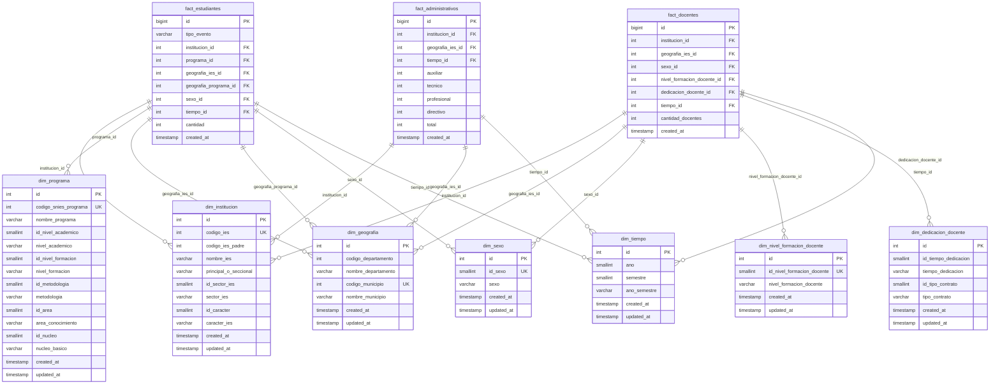

# Star Schema — Datos SNIES (Educación Superior Colombia)

## 1. Visión General

Esquema de estrella diseñado para análisis dimensional de los datos del **Sistema Nacional de Información de la Educación Superior (SNIES)** del Ministerio de Educación de Colombia.

```
                          ┌─────────────────┐
                          │ dim_institucion  │
                          └────────┬────────┘
                                   │
    ┌──────────────┐    ┌──────────┴──────────┐    ┌──────────────┐
    │  dim_programa │────│   fact_estudiantes  │────│  dim_tiempo  │
    └──────────────┘    └──────────┬──────────┘    └──────────────┘
                                   │
                          ┌────────┴────────┐
                          │  dim_geografia  │
                          └────────┬────────┘
                                   │
                          ┌────────┴────────┐
                          │    dim_sexo     │
                          └─────────────────┘


    ┌──────────────────┐    ┌───────────────────┐
    │  dim_institucion │────│   fact_docentes   │──── dim_tiempo
    └──────────────────┘    └────────┬──────────┘
                                     │
                            dim_geografia, dim_sexo,
                            dim_nivel_formacion_docente,
                            dim_dedicacion_docente


    ┌──────────────────┐    ┌─────────────────────┐
    │  dim_institucion │────│ fact_administrativos │──── dim_tiempo
    └──────────────────┘    └─────────┬───────────┘
                                      │
                             dim_geografia
```

---

## 2. Fuentes de Datos y Categorías SNIES

| Categoría SNIES             | Tabla de Hechos        | Medida Principal              |
|-----------------------------|------------------------|-------------------------------|
| `inscritos`                 | `fact_estudiantes`     | `cantidad` (tipo=inscritos)   |
| `admitidos`                 | `fact_estudiantes`     | `cantidad` (tipo=admitidos)   |
| `matriculados`              | `fact_estudiantes`     | `cantidad` (tipo=matriculados)|
| `matriculados_primer_curso` | `fact_estudiantes`     | `cantidad` (tipo=primer_curso)|
| `graduados`                 | `fact_estudiantes`     | `cantidad` (tipo=graduados)   |
| `docentes`                  | `fact_docentes`        | `cantidad_docentes`           |
| `administrativos`           | `fact_administrativos` | `auxiliar`, `tecnico`, `profesional`, `directivo`, `total` |

> **Decisión de diseño:** Inscritos, admitidos, matriculados, matriculados primer curso y graduados
> comparten la misma estructura dimensional (institución + programa + geografía + sexo + tiempo),
> por lo que se consolidan en una sola tabla de hechos `fact_estudiantes` con un discriminador
> `tipo_evento`. Esto evita 5 tablas casi idénticas y simplifica queries comparativos.

---

## 3. Tablas de Dimensiones

### 3.1 `dim_institucion`

Representa a cada Institución de Educación Superior (IES).

| Columna                | Tipo           | Descripción                                  |
|------------------------|----------------|----------------------------------------------|
| `id`                   | `INTEGER PK`   | Surrogate key (autoincrement)                |
| `codigo_ies`           | `INTEGER`      | Código del Ministerio (business key)         |
| `codigo_ies_padre`     | `INTEGER`      | Código IES padre (seccionales)               |
| `nombre_ies`           | `VARCHAR(300)` | Nombre completo de la IES                    |
| `principal_o_seccional`| `VARCHAR(50)`  | "Principal" o "Seccional"                    |
| `id_sector_ies`        | `SMALLINT`     | ID numérico del sector                       |
| `sector_ies`           | `VARCHAR(50)`  | "Oficial" / "Privada"                        |
| `id_caracter`          | `SMALLINT`     | ID numérico del carácter                     |
| `caracter_ies`         | `VARCHAR(100)` | Universidad, Inst. Tecnológica, etc.         |
| `created_at`           | `TIMESTAMP`    | Fecha de creación del registro               |
| `updated_at`           | `TIMESTAMP`    | Fecha de última actualización                |

**Índice único:** `(codigo_ies)`

### 3.2 `dim_geografia`

Representa ubicaciones geográficas (departamento + municipio). Se usa tanto para la ubicación de la IES como para la ubicación de oferta del programa.

| Columna                | Tipo           | Descripción                                  |
|------------------------|----------------|----------------------------------------------|
| `id`                   | `INTEGER PK`   | Surrogate key (autoincrement)                |
| `codigo_departamento`  | `INTEGER`      | Código DANE del departamento                 |
| `nombre_departamento`  | `VARCHAR(100)` | Nombre del departamento                      |
| `codigo_municipio`     | `INTEGER`      | Código DANE del municipio (business key)     |
| `nombre_municipio`     | `VARCHAR(100)` | Nombre del municipio                         |
| `created_at`           | `TIMESTAMP`    | Fecha de creación del registro               |
| `updated_at`           | `TIMESTAMP`    | Fecha de última actualización                |

**Índice único:** `(codigo_municipio)`

### 3.3 `dim_programa`

Representa cada programa académico ofertado.

| Columna                | Tipo           | Descripción                                  |
|------------------------|----------------|----------------------------------------------|
| `id`                   | `INTEGER PK`   | Surrogate key (autoincrement)                |
| `codigo_snies_programa`| `INTEGER`      | Código SNIES del programa (business key)     |
| `nombre_programa`      | `VARCHAR(500)` | Nombre del programa académico                |
| `id_nivel_academico`   | `SMALLINT`     | ID del nivel académico                       |
| `nivel_academico`      | `VARCHAR(50)`  | Pregrado / Posgrado                          |
| `id_nivel_formacion`   | `SMALLINT`     | ID del nivel de formación                    |
| `nivel_formacion`      | `VARCHAR(100)` | Técnico, Tecnológico, Universitario, etc.    |
| `id_metodologia`       | `SMALLINT`     | ID de la metodología                         |
| `metodologia`          | `VARCHAR(50)`  | Presencial / Distancia / Virtual             |
| `id_area`              | `SMALLINT`     | ID del área de conocimiento                  |
| `area_conocimiento`    | `VARCHAR(200)` | Área de conocimiento                         |
| `id_nucleo`            | `SMALLINT`     | ID del NBC                                   |
| `nucleo_basico`        | `VARCHAR(300)` | Núcleo Básico del Conocimiento (NBC)         |
| `created_at`           | `TIMESTAMP`    | Fecha de creación del registro               |
| `updated_at`           | `TIMESTAMP`    | Fecha de última actualización                |

**Índice único:** `(codigo_snies_programa)`

### 3.4 `dim_tiempo`

Dimensión temporal con granularidad semestre.

| Columna                | Tipo           | Descripción                                  |
|------------------------|----------------|----------------------------------------------|
| `id`                   | `INTEGER PK`   | Surrogate key (autoincrement)                |
| `ano`                  | `SMALLINT`     | Año (2018–2024+)                             |
| `semestre`             | `SMALLINT`     | Semestre (1 o 2)                             |
| `ano_semestre`         | `VARCHAR(7)`   | Label legible: "2024-1", "2024-2"            |
| `created_at`           | `TIMESTAMP`    | Fecha de creación del registro               |
| `updated_at`           | `TIMESTAMP`    | Fecha de última actualización                |

**Índice único:** `(ano, semestre)`

### 3.5 `dim_sexo`

Dimensión de género/sexo.

| Columna                | Tipo           | Descripción                                  |
|------------------------|----------------|----------------------------------------------|
| `id`                   | `INTEGER PK`   | Surrogate key (autoincrement)                |
| `id_sexo`              | `SMALLINT`     | ID numérico original SNIES                   |
| `sexo`                 | `VARCHAR(30)`  | "Masculino" / "Femenino"                     |
| `created_at`           | `TIMESTAMP`    | Fecha de creación del registro               |
| `updated_at`           | `TIMESTAMP`    | Fecha de última actualización                |

**Índice único:** `(id_sexo)`

### 3.6 `dim_nivel_formacion_docente`

Dimensión específica para el máximo nivel de formación de docentes.

| Columna                         | Tipo           | Descripción                         |
|---------------------------------|----------------|-------------------------------------|
| `id`                            | `INTEGER PK`   | Surrogate key (autoincrement)       |
| `id_nivel_formacion_docente`    | `SMALLINT`     | ID original SNIES                   |
| `nivel_formacion_docente`       | `VARCHAR(100)` | Doctorado, Maestría, etc.           |
| `created_at`                    | `TIMESTAMP`    | Fecha de creación                   |
| `updated_at`                    | `TIMESTAMP`    | Fecha de última actualización       |

**Índice único:** `(id_nivel_formacion_docente)`

### 3.7 `dim_dedicacion_docente`

Dimensión para tiempo de dedicación y tipo de contrato de docentes.

| Columna                   | Tipo           | Descripción                              |
|---------------------------|----------------|------------------------------------------|
| `id`                      | `INTEGER PK`   | Surrogate key (autoincrement)            |
| `id_tiempo_dedicacion`    | `SMALLINT`     | ID original SNIES                        |
| `tiempo_dedicacion`       | `VARCHAR(100)` | Tiempo Completo, Medio Tiempo, etc.      |
| `id_tipo_contrato`        | `SMALLINT`     | ID tipo de contrato                      |
| `tipo_contrato`           | `VARCHAR(100)` | Planta, Ocasional, Cátedra, etc.         |
| `created_at`              | `TIMESTAMP`    | Fecha de creación                        |
| `updated_at`              | `TIMESTAMP`    | Fecha de última actualización            |

**Índice único:** `(id_tiempo_dedicacion, id_tipo_contrato)`

---

## 4. Tablas de Hechos

### 4.1 `fact_estudiantes`

Tabla de hechos consolidada para inscritos, admitidos, matriculados, matriculados de primer curso y graduados. Granularidad: **1 fila = combinación única de (tipo_evento, institución, programa, geografía IES, geografía programa, sexo, tiempo)**.

| Columna                     | Tipo           | Descripción                               |
|-----------------------------|----------------|-------------------------------------------|
| `id`                        | `BIGINT PK`    | Surrogate key (autoincrement)             |
| `tipo_evento`               | `VARCHAR(30)`  | 'inscritos', 'admitidos', 'matriculados', 'primer_curso', 'graduados' |
| `institucion_id`            | `INTEGER FK`   | → `dim_institucion.id`                    |
| `programa_id`               | `INTEGER FK`   | → `dim_programa.id`                       |
| `geografia_ies_id`          | `INTEGER FK`   | → `dim_geografia.id` (ubicación IES)      |
| `geografia_programa_id`     | `INTEGER FK`   | → `dim_geografia.id` (ubicación programa) |
| `sexo_id`                   | `INTEGER FK`   | → `dim_sexo.id`                           |
| `tiempo_id`                 | `INTEGER FK`   | → `dim_tiempo.id`                         |
| `cantidad`                  | `INTEGER`      | Conteo (métrica principal)                |
| `created_at`                | `TIMESTAMP`    | Fecha de creación del registro            |

**Índices:**
- Cada FK individualmente
- Compuesto: `(tipo_evento, tiempo_id)` — para filtrar por tipo y periodo
- Compuesto: `(tipo_evento, institucion_id, tiempo_id)` — para series temporales por IES

### 4.2 `fact_docentes`

Tabla de hechos para personal docente. Granularidad: **1 fila = combinación única de (institución, geografía IES, sexo, nivel formación, dedicación, tiempo)**.

| Columna                          | Tipo           | Descripción                          |
|----------------------------------|----------------|--------------------------------------|
| `id`                             | `BIGINT PK`    | Surrogate key (autoincrement)        |
| `institucion_id`                 | `INTEGER FK`   | → `dim_institucion.id`              |
| `geografia_ies_id`               | `INTEGER FK`   | → `dim_geografia.id`               |
| `sexo_id`                        | `INTEGER FK`   | → `dim_sexo.id`                    |
| `nivel_formacion_docente_id`     | `INTEGER FK`   | → `dim_nivel_formacion_docente.id` |
| `dedicacion_docente_id`          | `INTEGER FK`   | → `dim_dedicacion_docente.id`      |
| `tiempo_id`                      | `INTEGER FK`   | → `dim_tiempo.id`                  |
| `cantidad_docentes`              | `INTEGER`      | Número de docentes                   |
| `created_at`                     | `TIMESTAMP`    | Fecha de creación del registro       |

**Índices:**
- Cada FK individualmente
- Compuesto: `(institucion_id, tiempo_id)`

### 4.3 `fact_administrativos`

Tabla de hechos para personal administrativo. Granularidad: **1 fila = combinación única de (institución, geografía IES, tiempo)**.

| Columna                | Tipo           | Descripción                               |
|------------------------|----------------|-------------------------------------------|
| `id`                   | `BIGINT PK`    | Surrogate key (autoincrement)             |
| `institucion_id`       | `INTEGER FK`   | → `dim_institucion.id`                   |
| `geografia_ies_id`     | `INTEGER FK`   | → `dim_geografia.id`                     |
| `tiempo_id`            | `INTEGER FK`   | → `dim_tiempo.id`                        |
| `auxiliar`             | `INTEGER`      | Conteo personal auxiliar                   |
| `tecnico`              | `INTEGER`      | Conteo personal técnico                    |
| `profesional`          | `INTEGER`      | Conteo personal profesional                |
| `directivo`            | `INTEGER`      | Conteo personal directivo                  |
| `total`                | `INTEGER`      | Total personal administrativo              |
| `created_at`           | `TIMESTAMP`    | Fecha de creación del registro             |

**Índices:**
- Cada FK individualmente
- Compuesto: `(institucion_id, tiempo_id)`

---

## 5. Mapeo: Columnas Fuente → Dimensiones

### Categorías de Estudiantes (inscritos, admitidos, matriculados, matriculados_primer_curso, graduados)

| Columna Fuente SNIES                              | Dimensión / Hecho              | Columna Destino             |
|---------------------------------------------------|--------------------------------|-----------------------------|
| `codigo_de_la_institucion`                         | `dim_institucion`              | `codigo_ies`                |
| `ies_padre`                                        | `dim_institucion`              | `codigo_ies_padre`          |
| `institucion_de_educacion_superior_ies`            | `dim_institucion`              | `nombre_ies`                |
| `principal_o_seccional`                            | `dim_institucion`              | `principal_o_seccional`     |
| `id_sector_ies` / `sector_ies`                     | `dim_institucion`              | `id_sector_ies` / `sector_ies` |
| `id_caracter` / `caracter_ies`                     | `dim_institucion`              | `id_caracter` / `caracter_ies` |
| `codigo_del_departamento_ies`                      | `dim_geografia` (IES)          | `codigo_departamento`       |
| `departamento_de_domicilio_de_la_ies`              | `dim_geografia` (IES)          | `nombre_departamento`       |
| `codigo_del_municipio_ies`                         | `dim_geografia` (IES)          | `codigo_municipio`          |
| `municipio_de_domicilio_de_la_ies`                 | `dim_geografia` (IES)          | `nombre_municipio`          |
| `codigo_snies_del_programa`                        | `dim_programa`                 | `codigo_snies_programa`     |
| `programa_academico`                               | `dim_programa`                 | `nombre_programa`           |
| `id_nivel_academico` / `nivel_academico`           | `dim_programa`                 | `id_nivel_academico` / `nivel_academico` |
| `id_nivel_de_formacion` / `nivel_de_formacion`     | `dim_programa`                 | `id_nivel_formacion` / `nivel_formacion` |
| `id_metodologia` / `metodologia`                   | `dim_programa`                 | `id_metodologia` / `metodologia` |
| `id_area` / `area_de_conocimiento`                 | `dim_programa`                 | `id_area` / `area_conocimiento` |
| `id_nucleo` / `nucleo_basico_del_conocimiento_nbc` | `dim_programa`                 | `id_nucleo` / `nucleo_basico` |
| `codigo_del_departamento_programa`                 | `dim_geografia` (programa)     | `codigo_departamento`       |
| `departamento_de_oferta_del_programa`              | `dim_geografia` (programa)     | `nombre_departamento`       |
| `codigo_del_municipio_programa`                    | `dim_geografia` (programa)     | `codigo_municipio`          |
| `municipio_de_oferta_del_programa`                 | `dim_geografia` (programa)     | `nombre_municipio`          |
| `id_sexo` / `sexo`                                 | `dim_sexo`                     | `id_sexo` / `sexo`         |
| `ano`                                              | `dim_tiempo`                   | `ano`                       |
| `semestre`                                         | `dim_tiempo`                   | `semestre`                  |
| `inscritos` / `admitidos` / `matriculados` / etc.  | `fact_estudiantes`             | `cantidad`                  |

---

## 6. SQL — Creación de Tablas

> Compatible con **PostgreSQL 15+**. Para SQLite, ajustar tipos de datos según corresponda.

```sql
-- ============================================================
-- STAR SCHEMA: SNIES — Educación Superior Colombia
-- Base de datos: PostgreSQL 15+
-- Generado: 2026-02-27
-- ============================================================

BEGIN;

-- ────────────────────────────────────────────────────────────
-- DIMENSIONES
-- ────────────────────────────────────────────────────────────

CREATE TABLE dim_institucion (
    id                      SERIAL          PRIMARY KEY,
    codigo_ies              INTEGER         NOT NULL,
    codigo_ies_padre        INTEGER,
    nombre_ies              VARCHAR(300)    NOT NULL,
    principal_o_seccional   VARCHAR(50),
    id_sector_ies           SMALLINT,
    sector_ies              VARCHAR(50),
    id_caracter             SMALLINT,
    caracter_ies            VARCHAR(100),
    created_at              TIMESTAMP       NOT NULL DEFAULT NOW(),
    updated_at              TIMESTAMP       NOT NULL DEFAULT NOW(),

    CONSTRAINT uq_dim_institucion_codigo UNIQUE (codigo_ies)
);

CREATE INDEX idx_dim_institucion_sector
    ON dim_institucion (id_sector_ies);

CREATE INDEX idx_dim_institucion_caracter
    ON dim_institucion (id_caracter);

COMMENT ON TABLE dim_institucion IS
    'Dimensión IES — Instituciones de Educación Superior registradas en el SNIES';


-- ────────────────────────────────────────────────────────────

CREATE TABLE dim_geografia (
    id                      SERIAL          PRIMARY KEY,
    codigo_departamento     INTEGER         NOT NULL,
    nombre_departamento     VARCHAR(100)    NOT NULL,
    codigo_municipio        INTEGER         NOT NULL,
    nombre_municipio        VARCHAR(100)    NOT NULL,
    created_at              TIMESTAMP       NOT NULL DEFAULT NOW(),
    updated_at              TIMESTAMP       NOT NULL DEFAULT NOW(),

    CONSTRAINT uq_dim_geografia_municipio UNIQUE (codigo_municipio)
);

CREATE INDEX idx_dim_geografia_depto
    ON dim_geografia (codigo_departamento);

COMMENT ON TABLE dim_geografia IS
    'Dimensión geográfica — Departamentos y municipios DANE. Usada tanto para ubicación de IES como de oferta de programa';


-- ────────────────────────────────────────────────────────────

CREATE TABLE dim_programa (
    id                      SERIAL          PRIMARY KEY,
    codigo_snies_programa   INTEGER         NOT NULL,
    nombre_programa         VARCHAR(500)    NOT NULL,
    id_nivel_academico      SMALLINT,
    nivel_academico         VARCHAR(50),
    id_nivel_formacion      SMALLINT,
    nivel_formacion         VARCHAR(100),
    id_metodologia          SMALLINT,
    metodologia             VARCHAR(50),
    id_area                 SMALLINT,
    area_conocimiento       VARCHAR(200),
    id_nucleo               SMALLINT,
    nucleo_basico           VARCHAR(300),
    created_at              TIMESTAMP       NOT NULL DEFAULT NOW(),
    updated_at              TIMESTAMP       NOT NULL DEFAULT NOW(),

    CONSTRAINT uq_dim_programa_snies UNIQUE (codigo_snies_programa)
);

CREATE INDEX idx_dim_programa_nivel
    ON dim_programa (id_nivel_academico);

CREATE INDEX idx_dim_programa_area
    ON dim_programa (id_area);

CREATE INDEX idx_dim_programa_metodologia
    ON dim_programa (id_metodologia);

COMMENT ON TABLE dim_programa IS
    'Dimensión programa académico — Programas registrados en el SNIES con clasificación por nivel, metodología y área de conocimiento';


-- ────────────────────────────────────────────────────────────

CREATE TABLE dim_tiempo (
    id                      SERIAL          PRIMARY KEY,
    ano                     SMALLINT        NOT NULL,
    semestre                SMALLINT        NOT NULL CHECK (semestre IN (1, 2)),
    ano_semestre            VARCHAR(7)      NOT NULL,
    created_at              TIMESTAMP       NOT NULL DEFAULT NOW(),
    updated_at              TIMESTAMP       NOT NULL DEFAULT NOW(),

    CONSTRAINT uq_dim_tiempo_periodo UNIQUE (ano, semestre)
);

COMMENT ON TABLE dim_tiempo IS
    'Dimensión temporal — Periodo académico (año + semestre)';


-- ────────────────────────────────────────────────────────────

CREATE TABLE dim_sexo (
    id                      SERIAL          PRIMARY KEY,
    id_sexo                 SMALLINT        NOT NULL,
    sexo                    VARCHAR(30)     NOT NULL,
    created_at              TIMESTAMP       NOT NULL DEFAULT NOW(),
    updated_at              TIMESTAMP       NOT NULL DEFAULT NOW(),

    CONSTRAINT uq_dim_sexo UNIQUE (id_sexo)
);

COMMENT ON TABLE dim_sexo IS
    'Dimensión sexo — Género biológico del estudiante o docente';


-- ────────────────────────────────────────────────────────────

CREATE TABLE dim_nivel_formacion_docente (
    id                              SERIAL          PRIMARY KEY,
    id_nivel_formacion_docente      SMALLINT        NOT NULL,
    nivel_formacion_docente         VARCHAR(100)    NOT NULL,
    created_at                      TIMESTAMP       NOT NULL DEFAULT NOW(),
    updated_at                      TIMESTAMP       NOT NULL DEFAULT NOW(),

    CONSTRAINT uq_dim_nivel_form_doc UNIQUE (id_nivel_formacion_docente)
);

COMMENT ON TABLE dim_nivel_formacion_docente IS
    'Dimensión nivel de formación del docente — Máximo título obtenido';


-- ────────────────────────────────────────────────────────────

CREATE TABLE dim_dedicacion_docente (
    id                      SERIAL          PRIMARY KEY,
    id_tiempo_dedicacion    SMALLINT        NOT NULL,
    tiempo_dedicacion       VARCHAR(100)    NOT NULL,
    id_tipo_contrato        SMALLINT        NOT NULL,
    tipo_contrato           VARCHAR(100)    NOT NULL,
    created_at              TIMESTAMP       NOT NULL DEFAULT NOW(),
    updated_at              TIMESTAMP       NOT NULL DEFAULT NOW(),

    CONSTRAINT uq_dim_dedicacion UNIQUE (id_tiempo_dedicacion, id_tipo_contrato)
);

COMMENT ON TABLE dim_dedicacion_docente IS
    'Dimensión dedicación docente — Combinación de tiempo de dedicación y tipo de contrato';


-- ────────────────────────────────────────────────────────────
-- TABLAS DE HECHOS
-- ────────────────────────────────────────────────────────────

CREATE TABLE fact_estudiantes (
    id                      BIGSERIAL       PRIMARY KEY,
    tipo_evento             VARCHAR(30)     NOT NULL
        CHECK (tipo_evento IN (
            'inscritos', 'admitidos', 'matriculados',
            'primer_curso', 'graduados'
        )),
    institucion_id          INTEGER         NOT NULL REFERENCES dim_institucion(id),
    programa_id             INTEGER         NOT NULL REFERENCES dim_programa(id),
    geografia_ies_id        INTEGER         NOT NULL REFERENCES dim_geografia(id),
    geografia_programa_id   INTEGER         NOT NULL REFERENCES dim_geografia(id),
    sexo_id                 INTEGER         NOT NULL REFERENCES dim_sexo(id),
    tiempo_id               INTEGER         NOT NULL REFERENCES dim_tiempo(id),
    cantidad                INTEGER         NOT NULL DEFAULT 0,
    created_at              TIMESTAMP       NOT NULL DEFAULT NOW()
);

-- Índices FK
CREATE INDEX idx_fact_est_institucion   ON fact_estudiantes (institucion_id);
CREATE INDEX idx_fact_est_programa      ON fact_estudiantes (programa_id);
CREATE INDEX idx_fact_est_geo_ies       ON fact_estudiantes (geografia_ies_id);
CREATE INDEX idx_fact_est_geo_prog      ON fact_estudiantes (geografia_programa_id);
CREATE INDEX idx_fact_est_sexo          ON fact_estudiantes (sexo_id);
CREATE INDEX idx_fact_est_tiempo        ON fact_estudiantes (tiempo_id);

-- Índices analíticos compuestos
CREATE INDEX idx_fact_est_tipo_tiempo
    ON fact_estudiantes (tipo_evento, tiempo_id);

CREATE INDEX idx_fact_est_tipo_inst_tiempo
    ON fact_estudiantes (tipo_evento, institucion_id, tiempo_id);

CREATE INDEX idx_fact_est_tipo_prog_tiempo
    ON fact_estudiantes (tipo_evento, programa_id, tiempo_id);

COMMENT ON TABLE fact_estudiantes IS
    'Hechos de estudiantes — Consolida inscritos, admitidos, matriculados, primer curso y graduados. La columna tipo_evento discrimina la categoría SNIES de origen';


-- ────────────────────────────────────────────────────────────

CREATE TABLE fact_docentes (
    id                              BIGSERIAL       PRIMARY KEY,
    institucion_id                  INTEGER         NOT NULL REFERENCES dim_institucion(id),
    geografia_ies_id                INTEGER         NOT NULL REFERENCES dim_geografia(id),
    sexo_id                         INTEGER         NOT NULL REFERENCES dim_sexo(id),
    nivel_formacion_docente_id      INTEGER         NOT NULL REFERENCES dim_nivel_formacion_docente(id),
    dedicacion_docente_id           INTEGER         NOT NULL REFERENCES dim_dedicacion_docente(id),
    tiempo_id                       INTEGER         NOT NULL REFERENCES dim_tiempo(id),
    cantidad_docentes               INTEGER         NOT NULL DEFAULT 0,
    created_at                      TIMESTAMP       NOT NULL DEFAULT NOW()
);

-- Índices FK
CREATE INDEX idx_fact_doc_institucion   ON fact_docentes (institucion_id);
CREATE INDEX idx_fact_doc_geo_ies       ON fact_docentes (geografia_ies_id);
CREATE INDEX idx_fact_doc_sexo          ON fact_docentes (sexo_id);
CREATE INDEX idx_fact_doc_nivel         ON fact_docentes (nivel_formacion_docente_id);
CREATE INDEX idx_fact_doc_dedicacion    ON fact_docentes (dedicacion_docente_id);
CREATE INDEX idx_fact_doc_tiempo        ON fact_docentes (tiempo_id);

-- Índices analíticos compuestos
CREATE INDEX idx_fact_doc_inst_tiempo
    ON fact_docentes (institucion_id, tiempo_id);

COMMENT ON TABLE fact_docentes IS
    'Hechos de docentes — Conteo de docentes por IES, formación, dedicación, sexo y periodo';


-- ────────────────────────────────────────────────────────────

CREATE TABLE fact_administrativos (
    id                      BIGSERIAL       PRIMARY KEY,
    institucion_id          INTEGER         NOT NULL REFERENCES dim_institucion(id),
    geografia_ies_id        INTEGER         NOT NULL REFERENCES dim_geografia(id),
    tiempo_id               INTEGER         NOT NULL REFERENCES dim_tiempo(id),
    auxiliar                INTEGER         NOT NULL DEFAULT 0,
    tecnico                 INTEGER         NOT NULL DEFAULT 0,
    profesional             INTEGER         NOT NULL DEFAULT 0,
    directivo               INTEGER         NOT NULL DEFAULT 0,
    total                   INTEGER         NOT NULL DEFAULT 0,
    created_at              TIMESTAMP       NOT NULL DEFAULT NOW()
);

-- Índices FK
CREATE INDEX idx_fact_adm_institucion   ON fact_administrativos (institucion_id);
CREATE INDEX idx_fact_adm_geo_ies       ON fact_administrativos (geografia_ies_id);
CREATE INDEX idx_fact_adm_tiempo        ON fact_administrativos (tiempo_id);

-- Índice analítico compuesto
CREATE INDEX idx_fact_adm_inst_tiempo
    ON fact_administrativos (institucion_id, tiempo_id);

COMMENT ON TABLE fact_administrativos IS
    'Hechos de administrativos — Conteo de personal administrativo por IES, cargo y periodo';


COMMIT;
```

---

## 7. SQL — Seed de `dim_tiempo`

Pre-carga los periodos conocidos (2018-S1 a 2024-S2):

```sql
INSERT INTO dim_tiempo (ano, semestre, ano_semestre) VALUES
    (2018, 1, '2018-1'), (2018, 2, '2018-2'),
    (2019, 1, '2019-1'), (2019, 2, '2019-2'),
    (2020, 1, '2020-1'), (2020, 2, '2020-2'),
    (2021, 1, '2021-1'), (2021, 2, '2021-2'),
    (2022, 1, '2022-1'), (2022, 2, '2022-2'),
    (2023, 1, '2023-1'), (2023, 2, '2023-2'),
    (2024, 1, '2024-1'), (2024, 2, '2024-2');
```

---

## 8. Queries Analíticos de Ejemplo

### 8.1 Matriculados por año y sector IES

```sql
SELECT
    dt.ano,
    dt.semestre,
    di.sector_ies,
    SUM(fe.cantidad)    AS total_matriculados
FROM fact_estudiantes fe
JOIN dim_tiempo       dt ON fe.tiempo_id       = dt.id
JOIN dim_institucion  di ON fe.institucion_id   = di.id
WHERE fe.tipo_evento = 'matriculados'
GROUP BY dt.ano, dt.semestre, di.sector_ies
ORDER BY dt.ano, dt.semestre;
```

### 8.2 Tasa de admisión (admitidos / inscritos) por programa

```sql
WITH metricas AS (
    SELECT
        fe.programa_id,
        fe.tiempo_id,
        SUM(CASE WHEN fe.tipo_evento = 'inscritos'  THEN fe.cantidad ELSE 0 END) AS inscritos,
        SUM(CASE WHEN fe.tipo_evento = 'admitidos'  THEN fe.cantidad ELSE 0 END) AS admitidos
    FROM fact_estudiantes fe
    WHERE fe.tipo_evento IN ('inscritos', 'admitidos')
    GROUP BY fe.programa_id, fe.tiempo_id
)
SELECT
    dp.nombre_programa,
    dt.ano_semestre,
    m.inscritos,
    m.admitidos,
    ROUND(m.admitidos * 100.0 / NULLIF(m.inscritos, 0), 2) AS tasa_admision_pct
FROM metricas m
JOIN dim_programa dp ON m.programa_id = dp.id
JOIN dim_tiempo  dt ON m.tiempo_id    = dt.id
WHERE m.inscritos > 0
ORDER BY tasa_admision_pct DESC
LIMIT 20;
```

### 8.3 Graduados por departamento y área de conocimiento

```sql
SELECT
    dg.nombre_departamento,
    dp.area_conocimiento,
    dt.ano,
    SUM(fe.cantidad) AS graduados
FROM fact_estudiantes fe
JOIN dim_geografia dg ON fe.geografia_programa_id = dg.id
JOIN dim_programa  dp ON fe.programa_id           = dp.id
JOIN dim_tiempo    dt ON fe.tiempo_id             = dt.id
WHERE fe.tipo_evento = 'graduados'
GROUP BY dg.nombre_departamento, dp.area_conocimiento, dt.ano
ORDER BY dt.ano DESC, graduados DESC;
```

### 8.4 Docentes por nivel de formación y tipo de dedicación

```sql
SELECT
    dt.ano_semestre,
    dnf.nivel_formacion_docente,
    dd.tiempo_dedicacion,
    dd.tipo_contrato,
    SUM(fd.cantidad_docentes) AS total_docentes
FROM fact_docentes fd
JOIN dim_tiempo                    dt  ON fd.tiempo_id                  = dt.id
JOIN dim_nivel_formacion_docente   dnf ON fd.nivel_formacion_docente_id = dnf.id
JOIN dim_dedicacion_docente        dd  ON fd.dedicacion_docente_id      = dd.id
GROUP BY dt.ano_semestre, dnf.nivel_formacion_docente, dd.tiempo_dedicacion, dd.tipo_contrato
ORDER BY dt.ano_semestre, total_docentes DESC;
```

### 8.5 Brecha de género en matrículas por metodología

```sql
SELECT
    dp.metodologia,
    dt.ano,
    ds.sexo,
    SUM(fe.cantidad) AS total
FROM fact_estudiantes fe
JOIN dim_programa dp ON fe.programa_id = dp.id
JOIN dim_tiempo   dt ON fe.tiempo_id   = dt.id
JOIN dim_sexo     ds ON fe.sexo_id     = ds.id
WHERE fe.tipo_evento = 'matriculados'
GROUP BY dp.metodologia, dt.ano, ds.sexo
ORDER BY dp.metodologia, dt.ano, ds.sexo;
```

---

## 9. Diagrama Entidad-Relación (Mermaid)



---

## 10. Decisiones de Diseño

| # | Decisión | Justificación |
|---|----------|---------------|
| 1 | **Fact consolidada** `fact_estudiantes` con discriminador `tipo_evento` | Las 5 categorías de estudiantes (inscritos, admitidos, matriculados, primer_curso, graduados) comparten exactamente las mismas dimensiones. Consolidarlas permite queries comparativos (ej. tasa de admisión) sin JOINs entre tablas de hechos. |
| 2 | **Dos FKs a `dim_geografia`** en `fact_estudiantes` | Los datos SNIES distinguen la ubicación de la IES (`departamento_ies`, `municipio_ies`) de la ubicación de oferta del programa (`departamento_programa`, `municipio_programa`). Un programa puede ofrecerse en un municipio diferente al domicilio de la IES. |
| 3 | **`dim_dedicacion_docente` combina dedicación + contrato** | En los datos fuente, dedicación y tipo de contrato siempre aparecen juntos y tienen cardinalidad baja (~15 combinaciones). Separarlas en dos dimensiones añadiría complejidad sin beneficio. |
| 4 | **Surrogate keys (SERIAL)** en todas las dimensiones | Desacoplan el esquema analítico de los códigos naturales del SNIES, que podrían cambiar. Los business keys se preservan como columnas con UNIQUE constraint. |
| 5 | **`fact_administrativos` sin `dim_sexo`** | Los datos fuente de administrativos no incluyen desglose por sexo; tienen desglose por tipo de cargo (auxiliar, técnico, profesional, directivo). |
| 6 | **`fact_docentes` separada** | Los docentes tienen dimensiones propias (nivel de formación, dedicación/contrato) que no aplican a estudiantes. Mezclarlos generaría NULLs masivos. |
| 7 | **Sin `updated_at` en facts** | Las tablas de hechos son append-only (inserción al cargar un periodo). Solo se necesita `created_at` para trazabilidad de carga. |
| 8 | **Índices compuestos orientados a queries comunes** | `(tipo_evento, tiempo_id)` y `(tipo_evento, institucion_id, tiempo_id)` optimizan los patrones de consulta más frecuentes: filtrar por tipo de evento y luego por periodo o institución. |

---

## 11. Volumen Estimado

| Tabla                   | Cardinalidad Estimada | Notas                                              |
|-------------------------|-----------------------|----------------------------------------------------|
| `dim_institucion`       | ~350                  | IES registradas en Colombia                        |
| `dim_geografia`         | ~1,200                | Municipios de Colombia                             |
| `dim_programa`          | ~15,000               | Programas registrados en el SNIES                  |
| `dim_tiempo`            | ~14                   | 7 años × 2 semestres (2018-2024)                  |
| `dim_sexo`              | 2-3                   | Masculino, Femenino (+ posible "Sin información")  |
| `dim_nivel_form_doc`    | ~8                    | Doctorado, Maestría, Especialización, etc.         |
| `dim_dedicacion_doc`    | ~15                   | Combinaciones dedicación × contrato                |
| `fact_estudiantes`      | ~5M-10M               | 5 tipos × ~350 IES × ~15K programas × periodos    |
| `fact_docentes`         | ~500K-1M              | Sin dimensión programa → menor granularidad        |
| `fact_administrativos`  | ~50K-100K             | Solo IES × geografía × tiempo                      |
